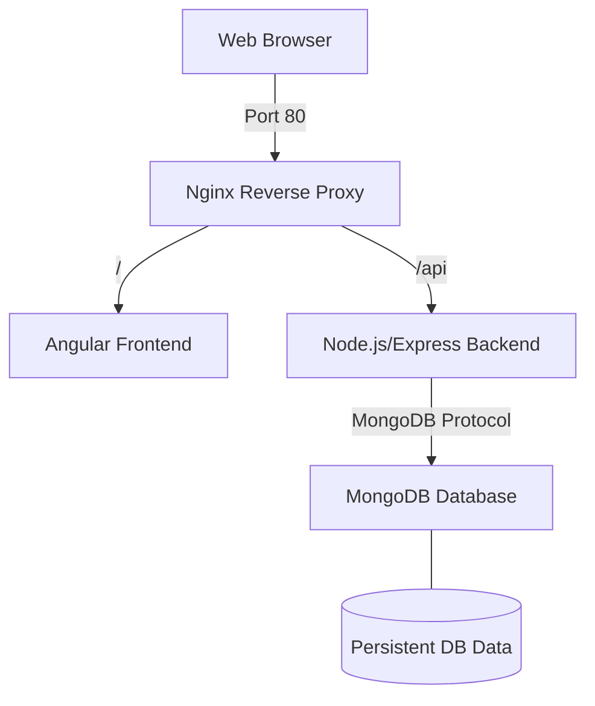

# MEAN Stack CRUD Application - DevOps Assignment

This project contains a full-stack MEAN (MongoDB, Express, Angular, Node.js) application, containerized and ready for deployment with a professional CI/CD pipeline using GitHub Actions.

## 🏗️ Architecture Overview

The following diagram illustrates how the components interact within the containerized environment:



## 📂 Project Structure

- `frontend/`: Angular 15 application (Containerized with Nginx).
- `backend/`: Express.js & Node.js API (Containerized).
- `nginx/`: Nginx reverse proxy configuration (served from frontend container).
- `docker-compose.yml`: Orchestrates MongoDB, Backend, and Frontend.
- `.github/workflows/deploy.yml`: GitHub Actions CI/CD pipeline.

## 🚀 Local Setup & Containerization

1.  **Clone the repository**:
    ```bash
    git clone https://github.com/shreyas080926/mean-crud-task.git
    cd mean-crud-task
    ```

2.  **Run with Docker Compose**:
    ```bash
    docker-compose up --build
    ```
    - **Frontend**: `http://localhost` (Port 80 via Nginx)
    - **Backend API**: `http://localhost:8080/api`
    - **MongoDB**: `mongodb://localhost:27017`

## 🔗 CI/CD Pipeline Configuration

The project uses **GitHub Actions** for automated build, push, and deployment.

### 1. Repository Secrets
Set up the following secrets in GitHub (**Settings > Secrets > Actions**):
- `DOCKER_USERNAME`: Your Docker Hub username.
- `DOCKER_PASSWORD`: Your Docker Hub token/password.
- `VM_IP`: The public IP of your Ubuntu VM.
- `SSH_PRIVATE_KEY`: Your private SSH key for VM access.

### 2. Deployment Workflow
- **Trigger**: Every push to the `main` branch.
- **Jobs**:
  - **Build & Push**: Builds Docker images and pushes to Docker Hub.
  - **Deploy**: Connects to the VM via SSH, pulls new images, and restarts containers.

## 🛠️ Deployment Details

- **Reverse Proxy**: Nginx routes all `/api` traffic to the backend and serves the Angular frontend as a Single Page Application (SPA).
- **Persistence**: MongoDB uses a Docker Volume to ensure data is not lost when the container stops.
- **Security**: The backend is hidden behind Nginx and is only accessible through the internal Docker network or proxied API routes.

## 📋 Task Deliverables Status

- [x] Dockerfiles for Frontend & Backend
- [x] Docker Hub image push capability
- [x] Docker Compose deployment
- [x] MongoDB Docker integration
- [x] GitHub Actions CI/CD Pipeline
- [x] Nginx Reverse Proxy (Port 80)
- [x] Professional Documentation & README
